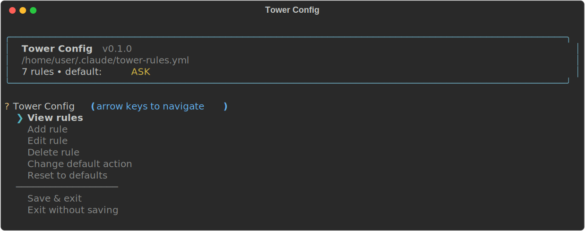
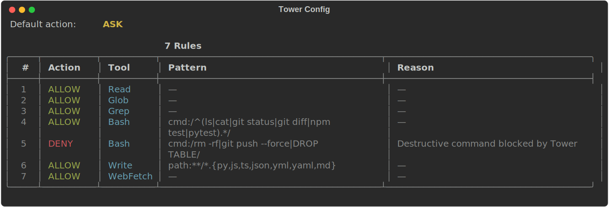
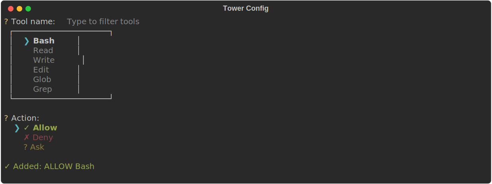
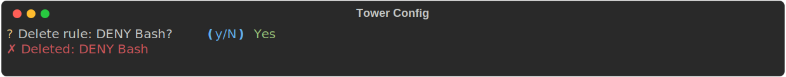

# Tower CLI

Permission evaluation agent for [Claude Code](https://docs.anthropic.com/en/docs/claude-code). Tower intercepts tool calls via a PreToolUse hook and applies configurable rules to allow, deny, or prompt before execution.

## Quick Start

```bash
pip install tower-cli
tower init
```

This creates `~/.claude/tower-rules.yml` and installs the PreToolUse hook in `~/.claude/settings.json` (global install, applies to all projects).

To install for a specific project instead:

```bash
cd your-project
tower init --local
```

If no config file exists when Tower evaluates a tool call, it automatically creates a default `~/.claude/tower-rules.yml` for you.

## Commands

| Command          | Description                                    |
|------------------|------------------------------------------------|
| `tower init`     | Create global config and install Claude hook   |
| `tower init --local` | Create project-local config and hook       |
| `tower status`   | Show current rules and hook installation state |
| `tower config`   | Launch interactive config editor               |
| `tower evaluate` | Evaluate a tool call from stdin (used by hook) |

## Interactive Config (`tower config`)

A rich, interactive TUI for managing your permission rules.

### Banner & Main Menu

On launch you see a styled banner with your config path, rule count, and default action, followed by the main menu with arrow-key navigation:

<p align="center">
  
</p>

### View Rules

Rules are displayed in a color-coded table with rounded borders. Actions are highlighted: green for ALLOW, red for DENY, yellow for ASK.

<p align="center">
  
</p>

### Add Rule

Tool selection uses fuzzy search (type to filter). Actions show color-coded symbols for quick recognition:

<p align="center">
  
</p>

### Delete Rule

Deletions require confirmation before taking effect:

<p align="center">
  
</p>

## Configuration

Tower looks for `tower-rules.yml` in these locations (first match wins):

1. `./tower-rules.yml`
2. `./.claude/tower-rules.yml`
3. `~/.claude/tower-rules.yml`

### Example Config

```yaml
version: 1
default: ask  # allow | deny | ask

rules:
  # Allow all file reads
  - tool: Read
    action: allow

  # Allow search tools
  - tool: Glob
    action: allow
  - tool: Grep
    action: allow

  # Allow safe bash commands
  - tool: Bash
    command_pattern: "^(ls|cat|git status|git diff|npm test|pytest).*"
    action: allow

  # Deny destructive commands
  - tool: Bash
    command_pattern: "rm -rf|git push --force|DROP TABLE"
    action: deny
    reason: "Destructive command blocked by Tower"

  # Allow writes to specific file types
  - tool: Write
    path_pattern: "**/*.{py,js,ts,json,yml,yaml,md}"
    action: allow
```

### Rule Fields

| Field             | Required | Description                                    |
|-------------------|----------|------------------------------------------------|
| `tool`            | Yes      | Tool name (Bash, Read, Write, Edit, Glob, etc) |
| `action`          | Yes      | `allow`, `deny`, or `ask`                      |
| `command_pattern` | No       | Regex pattern for Bash commands                 |
| `path_pattern`    | No       | Glob pattern for file paths                     |
| `reason`          | No       | Message shown when rule matches                 |

### How Evaluation Works

1. Claude Code invokes a tool (e.g., `Bash` with command `rm -rf /`)
2. The PreToolUse hook sends the tool call to `tower evaluate`
3. Tower checks rules top-to-bottom; the first matching rule wins
4. If no rule matches, the `default` action is used
5. Tower returns `allow`, `deny`, or `ask` to Claude Code

## Development

```bash
# Install with dev dependencies
pip install -e ".[dev]"

# Run tests
pytest
```

## Dependencies

- [PyYAML](https://pyyaml.org/) — config file parsing
- [InquirerPy](https://inquirerpy.readthedocs.io/) — interactive prompts
- [Rich](https://rich.readthedocs.io/) — styled terminal output
